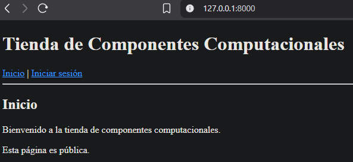
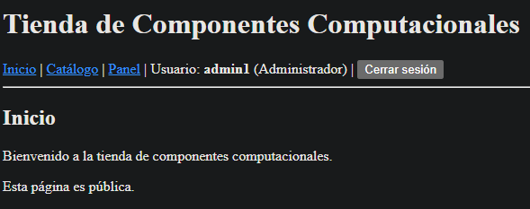
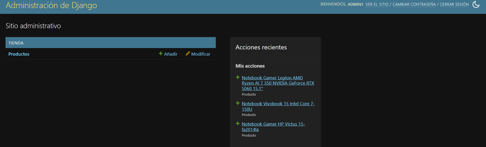
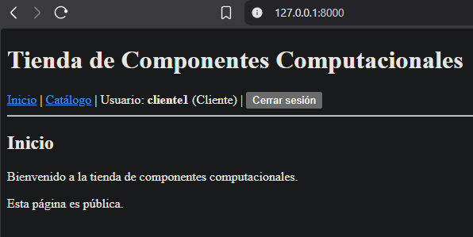
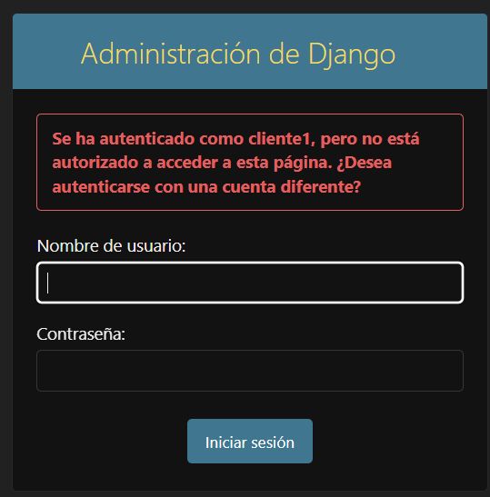

# DESARROLLO DE APLICACIONES WEB CON PYTHON DJANGO(V2)

## Tabla de contenidos
- [Desarrollo de aplicaciones web con python Django(V2)](#desarrollo-de-aplicaciones-web-con-python-djangov2)
    - [Tabla de contenidos](#tabla-de-contenidos)
    - [Instrucciones](#instrucciones)
    - [Instalación y ejecución del proyecto](#instalación-y-ejecución-del-proyecto)
    - [Credenciales de prueba](#credenciales-de-prueba)
    - [Vistas de accesos](#vistas-de-accesos)
    - [Estructura del proyecto](#estructura-del-proyecto)
    - [Autor](#autor)

## Instrucciones 
En todo sistema o software es importante gestionar la capa de seguridad de nuestro proyecto y los
estudiantes deberán realizar la implementación de un sistema de autenticación utilizando el modelo de
Login/Logout disponible en Django.

## Instalación y ejecución del proyecto

### 📦 Requisitos

* Python `3.14+`
* pip
* Visual Studio Code
* SQLite3 

---

### Entrar a la carpeta:

```bash
cd actividad_m6_l5
```

---

### Crear entorno virtual

```bash
python -m venv venv
```

---

### Activar entorno virtual

```bash
venv\Scripts\activate
```
---

### Instalar dependencias

```bash
pip install django
```

---

### Ejecutar servidor

```bash
python manage.py runserver
```

---

### Abrir proyecto
http://127.0.0.1:8000/

---

## Credenciales de prueba:

- Administrador:
    - Usuario: admin1
    - Contraseña: 
    - Acciones disponibles
        - Iniciar sesion
        - Acceder al catalogo
        - Acceder al panel administrativo
        - Acceso CRUD a la tabla `producto`

- Cliente:
    - Usuario: cliente1
    - Contraseña: 
    - Acciones disponibles: 
        - Iniciar sesion
        - Acceder al catalogo

## Vistas de accesos 
### Vista del HOME



---
### Usuario Administrador loggeado



---
#### Usuario Administrador con acceso a `Administracion de Django`



---
### Usuario Cliente loggeado



---
#### Usuario sin acceso a panel de `Administracion de Django`



---

## Estructura del proyecto

```
└── 📁LECCION5
    └── 📁actividad_m6_l5
        └── 📁config
            ├── __init__.py
            ├── asgi.py
            ├── settings.py
            ├── urls.py
            ├── wsgi.py
        └── 📁evidencia
            ├── image.png
            ├── image1.png
            ├── image2.png
            ├── image3.png
            ├── image4.png
            ├── image5.png
        └── 📁templates
            └── 📁registration
                ├── login.html
            ├── base.html
            ├── catalogo.html
            ├── inicio.html
            ├── panel.html
        └── 📁tienda
            └── 📁migrations
                ├── __init__.py
                ├── 0001_initial.py
            ├── __init__.py
            ├── admin.py
            ├── apps.py
            ├── models.py
            ├── tests.py
            ├── urls.py
            ├── views.py
        ├── db.sqlite3
        ├── manage.py
        ├── README.md
        ├── requirements.txt
```
## Autor

**Modulo 6 - MODELO LOGIN/LOGOUT - Leccion 5** 

**Alumno:** Jordan Carvajal - **Fecha:** 01-06-2026


@Cyber123
contrasena
